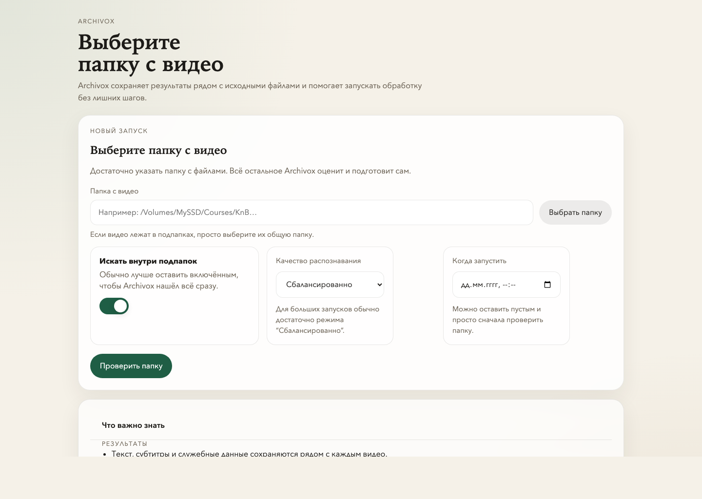

<p align="center">
  
</p>

<h1 align="center">Archivox</h1>

<p align="center">
  <strong>Local-first transcription for long-form archives.</strong><br />
  Folder in. Transcript out. No cloud upload required.
</p>

<p align="center">
  <a href="#one-command-install">Install</a> ·
  <a href="#how-it-works">How It Works</a> ·
  <a href="docs/product.md">Product Brief</a> ·
  <a href="docs/architecture.md">Architecture</a>
</p>

> Archivox is built for private media folders, course libraries, internal
> trainings, and long-form archives that need a practical overnight workflow.

| Built for | Output model | Runtime |
| --- | --- | --- |
| Large local folders and external SSDs | `.transcript.txt`, `.transcript.srt`, `.transcript.json` | Local web UI + resumable jobs |
| Privacy-sensitive archives | Outputs next to the source media | `FastAPI` + `faster-whisper` |
| Overnight batch processing | Hidden `.archivox/jobs/` metadata | Optional macOS background helpers |

## Why Archivox

Most transcription tools are designed for one file at a time or for cloud
upload. Archivox takes the opposite approach:

- keep the archive on your machine or external drive
- scan the whole folder instead of uploading file by file
- create resumable jobs for overnight runs
- write transcripts next to the original media
- keep service metadata inside a hidden local folder

It is a better fit when privacy matters, the archive is large, and the user
wants a clean `folder in, transcript out` workflow.

## One-command install

Install Archivox, set up dependencies, start the local web app, and open it in
your browser:

```bash
curl -fsSL https://raw.githubusercontent.com/RomanBilousov/Archivox/main/scripts/install.sh | bash
```

What this does:

- installs `uv` if it is missing
- clones or updates the repo in a local app directory
- runs `uv sync`
- starts Archivox in the background
- opens `http://127.0.0.1:8420`

<details>
<summary>Install variants</summary>

```bash
# Install but do not start
curl -fsSL https://raw.githubusercontent.com/RomanBilousov/Archivox/main/scripts/install.sh | ARCHIVOX_START_MODE=none bash

# Install into a custom folder
curl -fsSL https://raw.githubusercontent.com/RomanBilousov/Archivox/main/scripts/install.sh | ARCHIVOX_INSTALL_DIR="$HOME/Archivox" bash

# Install and also create the macOS launcher app
curl -fsSL https://raw.githubusercontent.com/RomanBilousov/Archivox/main/scripts/install.sh | ARCHIVOX_INSTALL_LAUNCHER_APP=1 bash
```

</details>

If you already cloned the repo manually:

```bash
./scripts/install.sh
```

## How It Works

1. Choose a local folder or external drive path.
2. Scan supported audio and video files.
3. Create a resumable batch job.
4. Run the job now or leave it overnight.
5. Get transcript files written next to each source file.

## What You Get

- local web UI powered by `FastAPI`
- recursive media scan for supported file types
- resumable job manifests stored in `.archivox/jobs/`
- batch transcription with `faster-whisper`
- transcript outputs in `txt`, `srt`, and `json`
- graceful stop after the current file
- optional macOS background helpers

## Output Layout

Given a source file like:

```text
/Volumes/Courses/Module 1/lesson-01.mp4
```

Archivox writes:

```text
lesson-01.transcript.txt
lesson-01.transcript.srt
lesson-01.transcript.json
```

Service metadata is stored under:

```text
/Volumes/Courses/.archivox/jobs/<job-id>.json
```

## Manual Setup

Requirements:

- Python `3.12+`
- [`uv`](https://docs.astral.sh/uv/)
- enough local disk space for generated transcripts and model downloads

Start manually:

```bash
uv sync
uv run archivox
```

Then open `http://127.0.0.1:8420`.

## CLI

Transcribe a single file:

```bash
uv run archivox-transcribe "/absolute/path/to/video.mp4" --profile fast
```

Run a planned manifest:

```bash
uv run archivox-run-job "/absolute/path/to/.archivox/jobs/<job-id>.json"
```

Profiles:

- `fast`
- `balanced`
- `best`

## Overnight Runs

If you want the machine to stay awake during a long run:

```bash
caffeinate -dimsu uv run archivox
```

Or for a planned manifest:

```bash
caffeinate -ism uv run archivox-run-job "/absolute/path/to/.archivox/jobs/<job-id>.json"
```

## macOS Helpers

<details>
<summary>Background scripts and launcher</summary>

Start in the background:

```bash
chmod +x scripts/*.sh
./scripts/start_background.sh
```

Check status:

```bash
./scripts/status_background.sh
```

Stop it:

```bash
./scripts/stop_background.sh
```

Install a LaunchAgent:

```bash
./scripts/install_launch_agent.sh
```

Uninstall it:

```bash
./scripts/uninstall_launch_agent.sh
```

Install a clickable macOS app wrapper:

```bash
./scripts/install_launcher_app.sh
```

This creates `~/Applications/Archivox.app`. If you move the repository later,
run the installer again so the launcher and LaunchAgent point to the new path.

</details>

## Project Structure

```text
Archivox/
├── app/                     # web app, job planning, transcription runtime
├── docs/                    # product and architecture notes
├── ops/macos/               # LaunchAgent template
├── scripts/                 # local start/stop/install helpers
├── pyproject.toml
└── README.md
```

## Notes

- transcript files are written next to the source media, not into a separate export folder
- hidden runtime metadata stays inside `.archivox/`
- this repository contains application code and helper scripts, not private media or runtime jobs
- logs live in `/tmp/archivox-web.out.log` and `/tmp/archivox-web.err.log`

If the repository stays inside `Documents`, macOS privacy rules may block the
LaunchAgent from starting reliably. In that case, prefer the background scripts
instead.

## Roadmap

- add an explicit `force re-run` toggle for already-transcribed files
- add per-job elapsed time and ETA in the UI
- optionally summarize transcripts into reusable knowledge notes
